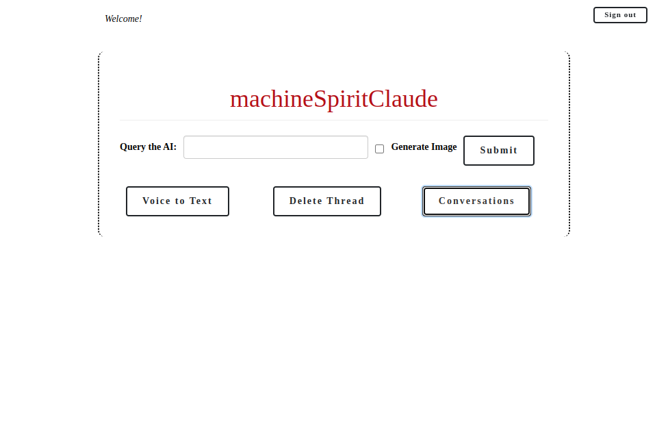

# README

# machineSpiritClaude: A Conversational Assistant Interface

machineSpiritClaude is a web-based conversational assistant interface designed to help users with their questions and requests. Built using Ruby on Rails and powered by the Chat GPT 4 large language model, machineSpiritClaude provides an intuitive and engaging way to interact with AI, along with practical features to make this interaction fruitful.

This is a progressive web app, and can be installed on near any machine, including Android phones, Unix and Windows-based computers, etc.

machineSpiritClaude is here to make working with AI easy; a simple and clean interface, great tools and features to make working with an AI practical and not a novelty. 

## Live Web Application

[machineSpiritClaude](https://ai.machinespiritclaude.com)

## Features

machineSpiritClaude offers a variety of features to ensure a seamless and engaging user experience:

- AI Image Generation using the Stable Diffusion API
- Text-based conversation: Users can engage in a text-based conversation with the AI-powered language model to get answers to their questions or receive help with their requests.
- Voice-to-text input: machineSpiritClaude supports voice-to-text input, enabling users to interact with the application by speaking their queries or commands.
- Downloadable PDFs: Users can download the latest response from the conversation as a PDF document for easy reference and sharing.
- Read-Response-Aloud: with the press of a button, the application will read the response from the AI aloud to the user
- Email Responses: with the press of a button, the application will open your default mail client with the body populated by the response from the AI

## Contributing

We welcome contributions to improve machineSpirit Claude and make it even more useful for users. If you have any ideas, suggestions, or bug reports, please feel free to open an issue or submit a pull request. We appreciate your help in making machineSpiritClaude a better interface with this  conversational assistant.

## License

machineSpiritClaude is private software.
## Author

machineSpiritClaude was developed by Christopher Bradford. If you have any questions or would like to get in touch, please contact him at ai@machinespiritclaude.com.

